## CIAO A TUTTI!

Prima cosa da fare: aprire questo file in modalita' Anteprima! Click destro su README.MD -> Apri ANTEPRIMA! Se non lo fate non vedete le immagini dentro questo file!

Ho creato una repo generica per il progetto che andremo a fare. Qualsiasi sia il progetto che Simo ci dira' di sviluppare, la base sara' questa.

## Per iniziare!

1. Il file .gitkeep in tutte le cartelle vuote dice semplicemente a GitHub di caricare la cartella vuota al push.
     In questo modo posso darvi una struttura base su cui lavoreremo

2. Dobbiamo capire una cosa importante sul lavorare con database locali nei propri pc: noi NON ABBIAMO UN DATABASE IN COMUNE, ma ognuno di noi ha il proprio db sul pc. 
   Capito questo avrete visto che ho creato una cartella SQL, in questa cartella mettero' piano piano dei file .sql che dovrete RUNNARE NEL VOSTRO DBEAVER.

## Cosa significa?

Significa che, visto che una sola persona si occupera' di creare le tabelle, noi tutti dovremmo averle uguali e identiche. E' controproducente che ognuno di noi si fermi a scrivere sql nel proprio DB per creare le tabelle o introdurre dati placeholder in esse.

La persona che si occupera' del DB quindi creera' una struttura DB sul proprio pc. Quando vedra' che tutto funziona dovra' creare un file tipo creazione_db.sql. Tutti gli altri dovranno semplicemente copiare quel documento, incollarlo in DBEAVER E CLICCARE LA FRECCIETTA ARANCIONE. In questo modo avremo tutti lo "stesso" DB sul proprio PC, evitando confusioni.

Nella cartella sql troverete un file di prova.sql per vedere come funziona.

1. COPIA TUTTO IL CONTENUTO DI prova.sql
2. APRI DBEAVER -> CLICK DESTRO SU POSTGRES -> EDITOR SQL -> NUOVO SCRIPT SQL
3. INCOLLA E POI PREMI LA FRECCIA ARANCIONE

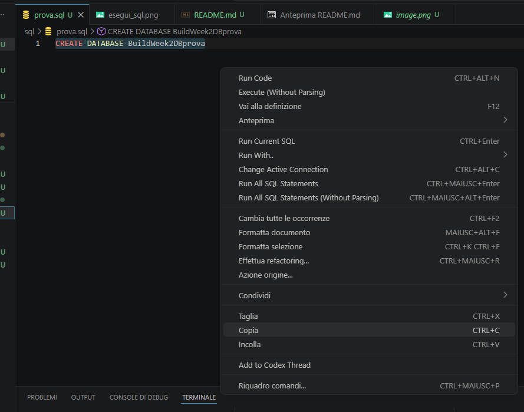 ----> 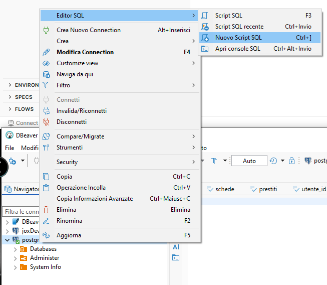 ----> 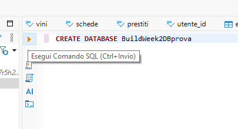

## Perche' dobbiamo fare cosi?

Andando avanti con la creazione complessa del DB ci vorrebbe troppo tempo se ognuno di noi scrivesse a mano gli sql per aggiornare il proprio DB sul pc.

La suddivisione dei compiti serve proprio a questo. Facilitare il lavoro degli altri componenti del team.

---

---

## PREPARIAMO IL BACKEND

Installiamo le dipendenze per il backend

1. Apri terminale in VSCode
2. Assicurati di essere nella cartella backend -> cd backend
3. npm i
    QUESTO INSTALLERA' TUTTE LE DIPENDENZE DI CUI IL BACKEND HA BISOGNO
    
    ORA COPIAMO IL CONTENUTO DI .env.example dentro un nuovo file .env
4. cp .env.example .env

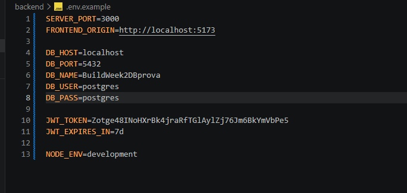

## TENETE A MENTE CHE QUANDO SAPREMO IL PROGETTO CHE ANDREMO A FARE, FAREMO UN DB DIVERSO E QUINDI DB_NAME DOVRA' ESSERE AGGIORNATO DI CONSEGUENZA

---

## PREPARIAMO IL FRONTEND

1. Se avete seguito i passaggi sopra, il vostro terminale sara' ancora nella cartella backend
2. cd .. (andate indietro di UNA cartella, SE NON METTETE .. torna indietro fino alla cartella PRINCIPALE DEL PC!!!!)
3. cd front
4. npm i
     QUESTO INSTALLA TUTTE LE DIPENDENZE DI REACT E ANCHE BOOTSTRAP E SASS

5. npm run dev
6. aprite la pagina che vi mostra nel terminale.

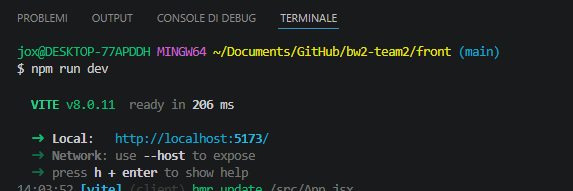

## SASS

Se avete gia' aperto il file app.jsx per curiosita', avrete notato che ho messo delle classi Bootstrap nel div.
Ma allora perche' quel div non e' al centro della pagina?

Perche' ancora non abbiamo compilato SASS. Quindi il css ancora non esiste sul vostro pc.

1. aprite un secondo terminale lasciando quello di React aperto
2. assicuratevi di essere nella cartella del front end -- cd front
3. npm run build-css
     Questo non solo vi creera' style.css ma anche la cartella in cui e' contenuto

Ora dovreste vedere quel div nel punto corretto

Per chi andra' a creare classi Bootstrap e compilare Sass, il comando da fare dopo il build e'
  npm run watch-css

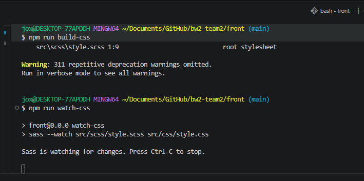

## Per il buon utilizzo di Bootstrap attraverso SASS

Vorrei esporvi un esempio di come sarebbe molto utile usare Bootstrap attraverso SASS.

SCSS, come sapete, e' un compilatore di css. Questo ci permette NON SOLO di crearci vari file tipo \_navbar.scss per ogni componente,  
ma, usandolo in combinazione con Bootstrap, ci permette anche di cambiare le variabili di Bootstrap e la loro stilizzazione.

Se aprite il file app.jsx vedrete che i due tag h1 e h2 hanno delle classi diverse.

Come potete vedere, il primo h1 e' rosso senza che venga specificato il colore rosso. 
Nel secondo h1 invece viene specificato il colore del text-success (classe standard di Bootstrap)

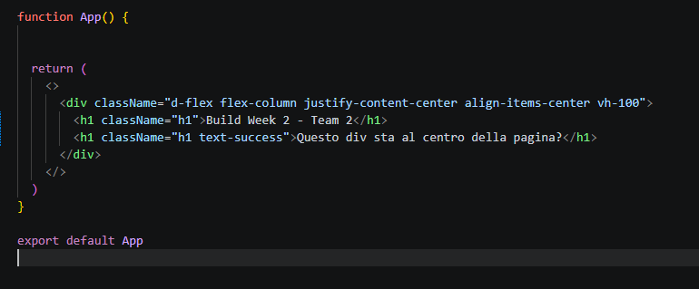 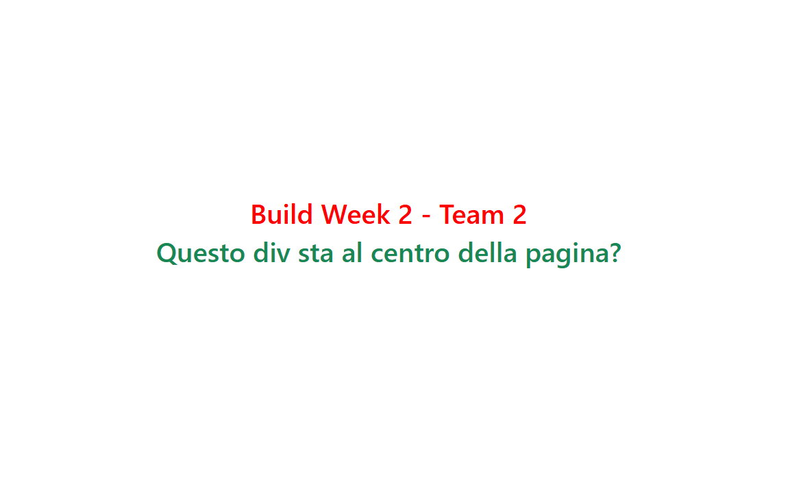

## E allora come fa il primo H1 ad essere rosso?

Ecco la sequenza in cui questo avviene

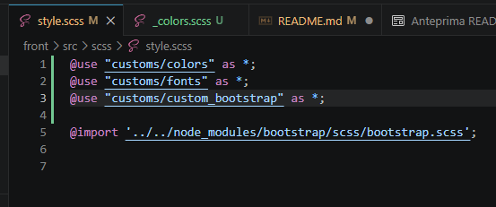 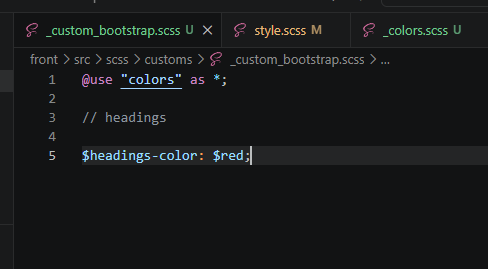 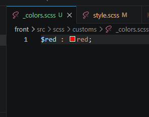

 

Il file style.scss contiene il file custom_bootstrap.scss, che a sua volta contiene il file colors.scss.

Nel file custom_bootstrap.scss viene specificata una variabile di Bootstrap che si occupa di dare un colore a TUTTI GLI HEADINGS! (H1, H2 ecc....)

## E quindi come so quale variabile di Bootstrap andare a cambiare per fare quello che voglio??

Esiste la BIBBIA DI BOOTSTRAP.

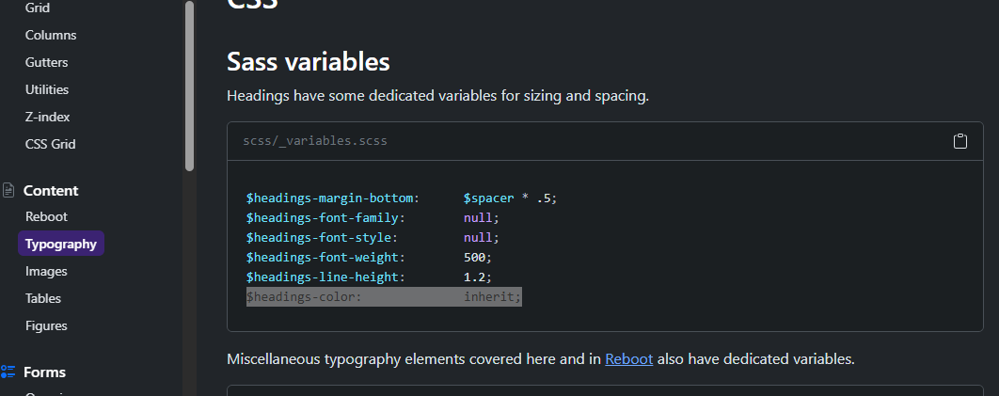

  In ogni pagina della documentazione di Bootstrap, ES: https://getbootstrap.com/docs/5.3/content/typography/

Se scendete troverete la sezione SASS VARIABLES: quelle sono le variabili che Bootstrap prende in considerazione quando crea una sua classe, per esempio la classe h1.

Con questo sistema si potrebbe andare a costruire un nostro personale btn-primary, per esempio con uno specifico colore di sfondo e quale colore avere all' hover.
 
Il tutto senza andare a scrivere css custom. Non sono contro il css custom in alcun modo, anzi in molti casi e' la soluzione piu' conveniente.
  Ma siamo qui per imparare e credo che ognuno di voi vorrebbe essere sicuro di se' quando nel proprio portfolio scrive di saper usare SCSS.

## OK tutto bello ma visto che questo modo di usare sass non lo conosciamo tutti, non finisce che ci rallentiamo il progetto?

Tecnicamente ho pensato di suddividere il team in due sottogruppi.
Il gruppo front end, per i primi due giorni, credo sara' composto solo da due persone.

  Queste due persone nel front end avranno compiti diversi per i primi due giorni.

1. Si occupera' di creare la STRUTTURA del front end.
     Per struttura intendo inserire i vari tag semantici html nelle pagine e nei componenti e dare loro delle classi Bootstrap standard.
     Per classi Bootstrap strutturali intendo d-flex, justify-content-center, btn-primary, navbar.... cose di questo tipo.

2. La seconda persona si occupera', invece, di stilizzare le classi a cui dobbiamo dare uno stile.
     Inutile sottolineare che non vanno modificate classi come il d-flex... ma cose come h1, h2, btn-primary, btn-secondary.

## Qual e' la vera utilita' di questo sistema?

La struttura puo' essere costruita liberamente e comunque.
Gli stili, se impostati attraverso il cambio di variabili Bootstrap, come avete capito possono essere modificati quando vogliamo. Se non ci piace lo stile finale quindi,
  non servira' andare a cambiare o levare classi nell'html, ma solamente cambiare il loro output attraverso il file custom_bootstrap.scss.

Siamo infine sicuri che l'intero progetto abbia uno stile unificato.

## QUESTA NON E' LA LEGGE DIVINA! Ho pensato a questo sistema per facilitare il lavoro e renderlo piu' snello e veloce, ma se non vi trovate bene si trovera' ovviamente un sistema migliore.

## Anche io sono qua per imparare. TVB

## Un ulteriore esempio di modifica di OUTPUT di una classe bootstrap

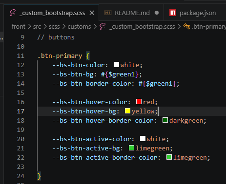

  In custom_bootstrap.scss c'e' un esempio di come ho modificato l'output di btn-primary
  Senza una modifica del genere, per avere un bottone cosi' avreste dovuto inserire
  class='btn btn-primary text-white bg-success border border-success'
  e per le modifiche dell'hover farvi delle classi custom

  invece cosi' scrivete 'btn btn-primary'. fine.

## Una sola linea guida per il backend.

Sarebbe molto comodo al frontend se da subito avessero dei dati dal DB su cui lavorare, quindi propongo di farci un server all-in-one-page
  per la prima giornata di lunedi' che esponga le route al frontend cosi' possono farci le fetch da subito e vedere come qualche dato viene visualizzato nei componenti.
  nei giorni successivi andare poi a fare il refactoring di quella pagina organizzandola in models, services, controllers e tutto quanto.

## Spero che queste linee guida ci aiutino tutti quanti a essere indipendenti nelle nostre mansioni.
